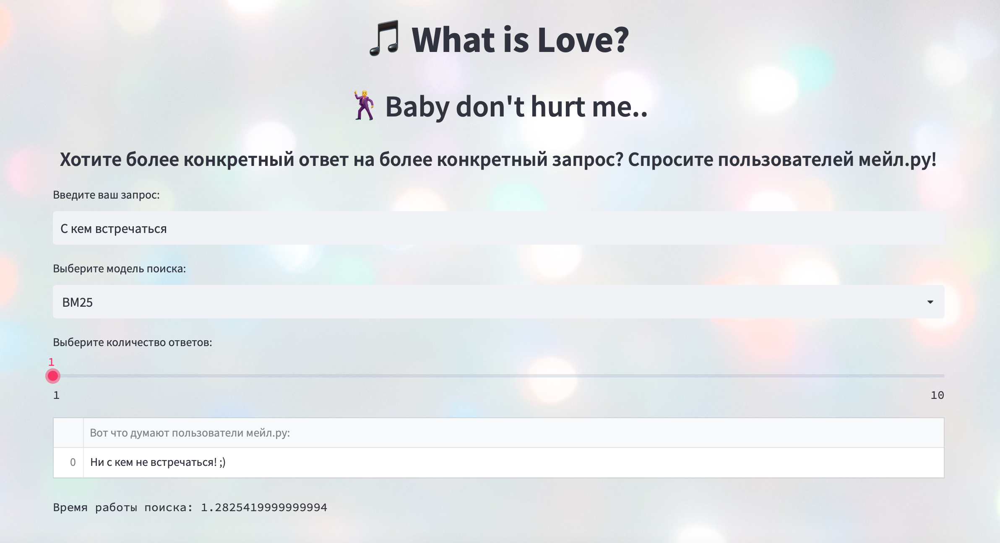

# Интерфейс

## Запуск

- Все необходимые файлы уже созданы и доступны по ссылке на гугл диске:

- Должны лежать в папке data
- Предобработанный корпус: https://drive.google.com/drive/folders/11XCONn_rVLQpyYfGdXk6P5mN6j7AForW?hl=ru

Пример запуска:
`
streamlit run main.py /Users/mariadolgodvorova/PycharmProjects/InfosearchProject
`
- Обязательный аргумент - полный путь к папке проекта (заканчивается на InfosearchProject)
### Папка src

- preprocess_data.py - предобработка данных

- create_corpora_file.py - создание корпуса ответов .txt из .jsonl. Из аргументов - путь к корпусу jsonl

Пример запуска:
`
python3 create_corpora_file.py data.jsonl
`
- create_pickle_files.py - создание файлов .pickle (и .pt для берта) с матрицами
    различных способов векторизации

Пример запуска:
`
python3 create_pickle_files.py ../data/prep_texts.txt /Users/mariadolgodvorova/PycharmProjects/InfosearchProject/

- ../data/prep_texts.txt - путь к предобработанному корпусу prep_texts
-  /Users/mariadolgodvorova/PycharmProjects/InfosearchProject/ - путь к проекту (заканчивается на InfosearchProject/ )
`
